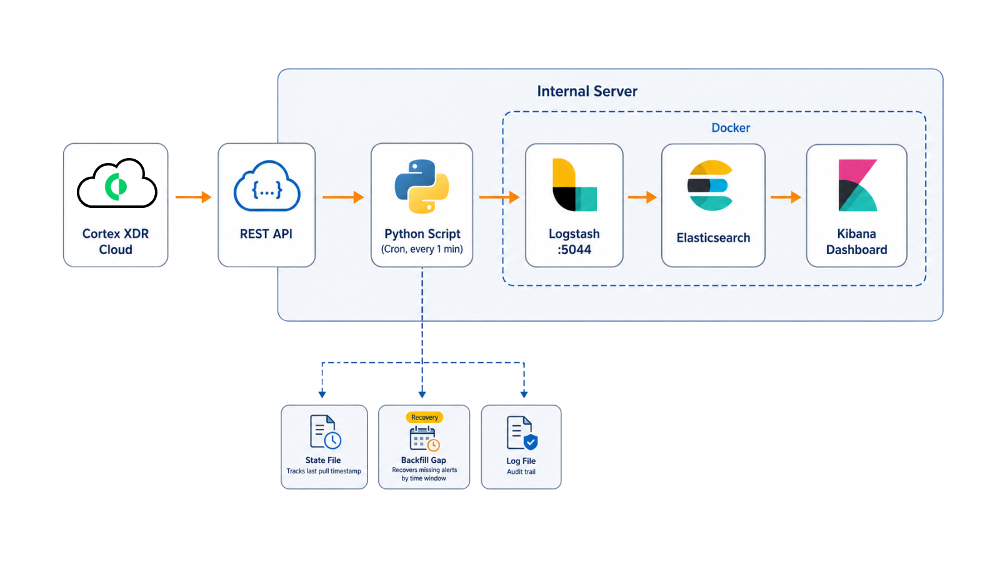
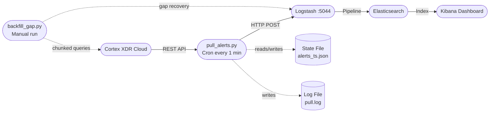

# Cortex XDR Alerts to ELK Pipeline

  

Incremental alert ingestion pipeline from **Cortex XDR Cloud** into an **ELK Stack** (Elasticsearch + Logstash + Kibana), running on a VPS via cron with cursor-based state, deduplication, and a gap-recovery backfill tool.

---

## Architecture





---

## Features

- **Incremental pull** — fetches only new alerts since the last run using a millisecond-epoch cursor on `creation_time`
- **Cursor-based state** — persists `last_creation_time_ms` in `state/alerts_ts.json` across cron runs
- **2-minute overlap** — each run steps back 120 seconds to catch late-arriving alerts from the Cortex API
- **Deduplication via `alert_id`** — alerts are upserted into Elasticsearch using `alert_id` as the document `_id`, making all pushes idempotent
- **Gap recovery** — `backfill_gap.py` back-fills any missed time range on demand
- **Chunked backfill** — queries are split into 1-hour windows (configurable) to avoid deep-offset HTTP 500 errors from the Cortex API
- **Resume support** — backfill saves chunk progress and can resume from where it left off with `--resume`

---

## Prerequisites

| Requirement | Notes |
|---|---|
| Docker + Docker Compose | ELK stack runs in containers |
| Python 3.10+ | `requests` library required |
| `cron` | For scheduling `pull_alerts.py` |
| Cortex XDR API credentials | `API_KEY`, `API_ID`, and tenant `BASE` URL |

Install Python dependencies:

```bash
pip install requests
```

---

## Getting Started

### 1. Clone the repository

```bash
git clone https://github.com/your-org/cortex-pipeline.git
cd cortex-pipeline
```

### 2. Configure credentials

Edit `python/pull_alerts.py` and `python/backfill_gap.py` — set the three constants at the top of each file:

```python
API_KEY = "YOUR_API_KEY"
API_ID  = "YOUR_API_ID"
BASE    = "https://your-tenant.xdr.us.paloaltonetworks.com"
```

Edit `docker-compose.yml` and `logstash/pipeline/cortex.conf` — replace the sample credentials with your actual Elasticsearch credentials.

### 3. Start the ELK stack

```bash
docker compose up -d
```

Verify containers are running:

```bash
docker compose ps
```

Elasticsearch will be available at `http://localhost:9200`, Kibana at `http://localhost:5601`.

### 4. Configure cron

Open the crontab editor:

```bash
crontab -e
```

Add the following line:

```
* * * * * /usr/bin/python3 /home/ubuntu/cortex-pipeline/python/pull_alerts.py >> /home/ubuntu/cortex-pipeline/logs/pull.log 2>&1
```

### 5. Verify the pipeline

Check that alerts are flowing:

```bash
# Watch the puller log in real time
tail -f logs/pull.log

# Verify data in Elasticsearch
curl -u elastic:YOUR_ELASTIC_PASSWORD http://localhost:9200/cortex-alerts/_count
```

Open Kibana at `http://localhost:5601` and create an index pattern for `cortex-alerts`.

---

## Configuration Reference

### `pull_alerts.py`

| Constant | Default | Description |
|---|---|---|
| `API_KEY` | *(required)* | Cortex XDR API key |
| `API_ID` | *(required)* | Cortex XDR API ID |
| `BASE` | *(required)* | Cortex XDR tenant base URL |
| `LOGSTASH` | `http://localhost:5044` | Logstash HTTP input endpoint |
| `STATE_FILE` | `state/alerts_ts.json` | Path to cursor state file |
| `LOG_FILE` | `logs/pull.log` | Path to puller audit log |
| `HEARTBEAT` | `state/cron_heartbeat.log` | Path to cron liveness log |
| `LIMIT` | `100` | Alerts per page (Cortex API max = 100) |
| `MAX_RETRIES` | `5` | Max retries per Cortex API call |
| `PUSH_RETRIES` | `3` | Max retries per Logstash push |
| `OVERLAP_MS` | `120000` | Backward overlap in milliseconds (2 minutes) |

### `backfill_gap.py`

| Constant | Default | Description |
|---|---|---|
| `API_KEY` | *(required)* | Cortex XDR API key |
| `API_ID` | *(required)* | Cortex XDR API ID |
| `BASE` | *(required)* | Cortex XDR tenant base URL |
| `LOGSTASH` | `http://localhost:5044` | Logstash HTTP input endpoint |
| `STATE_FILE` | `state/backfill_gap.json` | Resume state path |
| `LOG_FILE` | `logs/backfill_gap.log` | Backfill audit log path |
| `LIMIT` | `100` | Alerts per page |
| `CHUNK_HOURS` | `1` | Time window per chunk (hours) |
| `MAX_RETRIES` | `10` | Max retries per API call |
| `PUSH_RETRIES` | `3` | Max retries per Logstash push |
| `INTER_CHUNK_SLEEP` | `2` | Pause between chunks (seconds) |

---

## Backfill Gap Recovery

Use `backfill_gap.py` when you notice a time range with missing alerts — for example, after a cron outage, a VPS reboot, or a Logstash restart.

### When to use it

- Gap visible in Kibana time-series (e.g., no alerts for several hours)
- Cron was not running for a period
- Logstash was down and alerts were not ingested

### Usage

```bash
# Backfill a specific date range (UTC)
python3 python/backfill_gap.py \
  --start "2026-04-01 00:00:00" \
  --end   "2026-04-05 23:59:59"

# Use smaller chunks if you hit HTTP 500 errors (deep pagination)
python3 python/backfill_gap.py \
  --start "2026-04-01 00:00:00" \
  --end   "2026-04-05 23:59:59" \
  --chunk-hours 0.25

# Resume an interrupted backfill
python3 python/backfill_gap.py \
  --start "2026-04-01 00:00:00" \
  --end   "2026-04-05 23:59:59" \
  --resume
```

### `--resume` flag

During a backfill run, progress is saved to `state/backfill_gap.json` after each completed chunk. If the run is interrupted (Ctrl+C, network error, etc.), re-run with `--resume` and the same `--start`/`--end` arguments to skip already-processed chunks. The state file is automatically deleted after a successful full-run completion.

Backfilled alerts are tagged with `"_backfill": true` in Elasticsearch, making them filterable in Kibana.

---

## `.gitignore` Recommendations

The following **must not** be committed to the repository:

```gitignore
# Credentials — never commit API keys
python/pull_alerts.py   # contains API_KEY, API_ID, BASE (commit a sanitized template)
python/backfill_gap.py  # same

# Runtime logs — too large for version control
logs/

# Runtime state — generated at runtime
state/

# Backup files
*.bak
docker-compose.yml.bak
```

If you want to version-control the scripts, use environment variables or a separate `.env` / `config.py` file (gitignored) and import from there. Never hard-code credentials in tracked files.

---

## Project Structure

```
cortex-pipeline/
├── docker-compose.yml          # ELK stack (Elasticsearch, Logstash, Kibana) — v8.11.3
├── logstash/
│   └── pipeline/
│       └── cortex.conf         # Logstash pipeline: parse, timestamp, dedup, output
├── python/
│   ├── pull_alerts.py          # Main incremental puller (cron, every minute)
│   └── backfill_gap.py         # Gap recovery script (manual, --start/--end args)
├── state/
│   ├── alerts_ts.json          # Cursor state: last_creation_time_ms (runtime, gitignored)
│   └── cron_heartbeat.log      # Cron liveness log (runtime, gitignored)
└── logs/
    ├── pull.log                # Incremental puller audit log (runtime, gitignored)
    └── backfill_gap.log        # Backfill operation log (runtime, gitignored)
```

---

## How It Works

### Pull loop

Every minute, cron executes `pull_alerts.py`. The script reads `state/alerts_ts.json` to retrieve `last_creation_time_ms` — the millisecond epoch timestamp of the most recently seen alert. It subtracts `OVERLAP_MS` (120,000 ms = 2 minutes) from this cursor to define `since_ms`, then sets `until_ms` to the current time. This backward overlap ensures that alerts which appear in the Cortex API slightly after their nominal `creation_time` are not missed.

### Pagination and cursor advancement

The script queries the Cortex XDR `/public_api/v1/alerts/get_alerts/` endpoint with `search_from` / `search_to` offsets, sorted ascending by `creation_time`. It pages through results 100 alerts at a time (the API maximum) until `offset >= total_count`. After each page, it tracks the highest `creation_time` seen as `new_max_ts`. On completion, `new_max_ts` is written back to the state file as the new cursor.

### Deduplication

Each alert's `alert_id` is used as the Elasticsearch document `_id` via Logstash's `document_id` output option. This means re-pushing an alert that already exists in Elasticsearch performs an upsert rather than creating a duplicate document. Combined with the in-run `seen_ids` set, this makes the pipeline safe to run at any frequency without producing duplicates.

### Logstash pipeline

Logstash receives alerts via its HTTP input on port 5044. The `cortex.conf` pipeline converts `detection_timestamp`, `event_timestamp`, or `creation_time` (in that priority order) from millisecond epoch to `@timestamp`, and writes the alert to the `cortex-alerts` index with `document_id => alert_id`.

---

## Contributing

Pull requests are welcome. For significant changes, open an issue first to discuss the approach. Ensure all credential constants are replaced with placeholder values before committing any Python scripts.

## License

[MIT](LICENSE)
